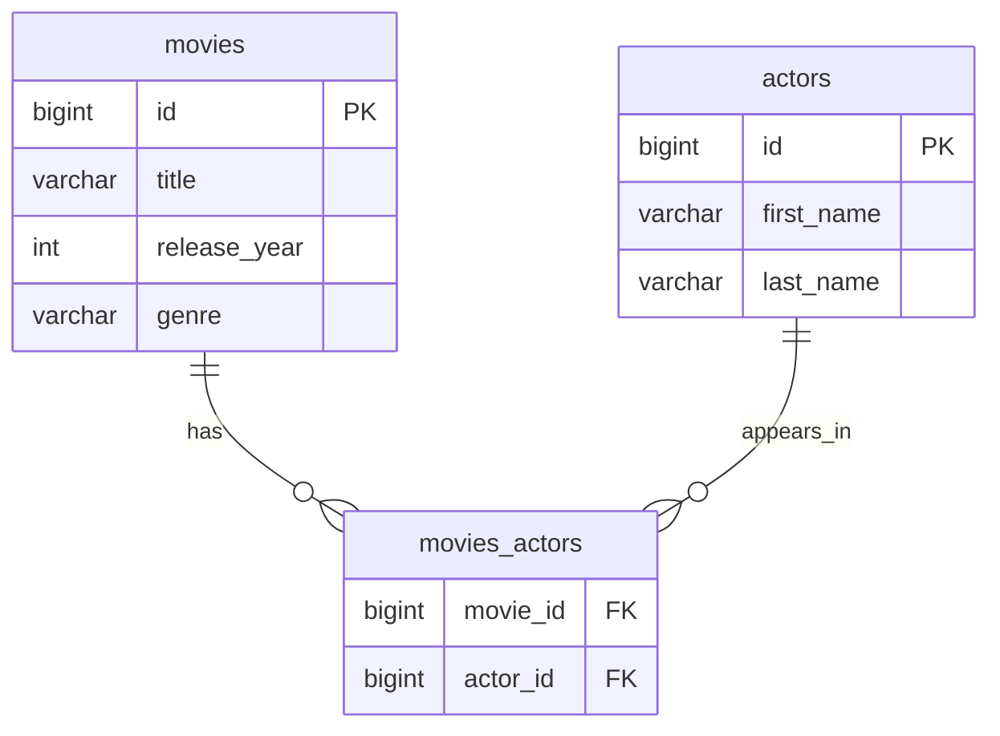
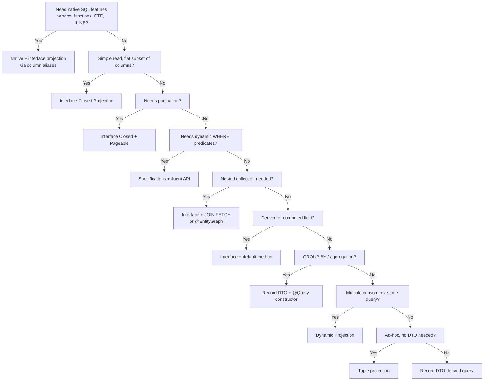

# jpa-projections

## What are projections?

A projection limits the columns a query returns to only what the caller needs.
Instead of loading a full entity (all columns, managed by the persistence context,
eligible for dirty checking), a projection fetches a subset of columns into a
lightweight read-only structure.

**Benefits**:
- **Less data over the wire**: narrower SQL `SELECT` means fewer bytes from
  database to application
- **No persistence context overhead**: projections are not attached to the
  `EntityManager`, so there is no dirty checking or snapshot maintenance
- **Clear contracts**: a projection type explicitly declares what data a
  consumer receives

## Quick Start

```bash
./mvnw spring-boot:run
```

### Available endpoints

| Endpoint                                                | Technique                              |
|---------------------------------------------------------|----------------------------------------|
| `GET /api/movies?genre=Sci-Fi`                          | Interface Closed                       |
| `GET /api/movies/paged?genre=Sci-Fi&page=0&size=2`      | Interface Closed + pagination          |
| `GET /api/movies/with-actors?genre=Sci-Fi`              | Interface + JOIN FETCH                 |
| `GET /api/movies/with-actors/entity-graph?genre=Sci-Fi` | Interface + @EntityGraph               |
| `GET /api/movies/with-actors/n-plus-one?genre=Sci-Fi`   | N+1 demonstration                      |
| `GET /api/actors?lastName=Freeman`                      | Interface + default method             |
| `GET /api/movies/search?title=The`                      | Record DTO (derived query)             |
| `GET /api/movies/after?year=2000`                       | Record DTO (@Query constructor)        |
| `GET /api/movies/stats/genre`                           | Aggregation record                     |
| `GET /api/movies/dynamic?genre=Sci-Fi&projection=dto`   | Dynamic projection                     |
| `GET /api/movies/native?genre=Sci-Fi`                   | Native + interface (aliases)           |
| `GET /api/movies/native/dto?genre=Sci-Fi`               | Native + DTO (SqlResultSetMapping)     |
| `GET /api/movies/tuples?genre=Sci-Fi`                   | Tuple projection                       |
| `GET /api/movies/spec?genre=Sci-Fi&minYear=2000`        | Specifications + fluent API            |
| `GET /api/movies/1/detail`                              | Hierarchical DTO (service assembly)    |
| `GET /api/actors/1/movies`                              | Actor with movies (two-query assembly) |

## Domain



## Projection types

### 1. Interface Closed Projection

```java
public interface MovieTitleView {
    Long getId();
    String getTitle();
}
```

```java
List<MovieTitleView> findByGenre(String genre);
```

**How it works**: Spring Data generates a `SELECT m.id, m.title FROM movie m …`
query at runtime. The result is backed by a dynamic proxy: each getter call
reads from the underlying `Tuple` without hitting the database.

**Generated SQL**:
```sql
SELECT m.id, m.title FROM movies m WHERE m.genre = ?
```

**When to use**: simple read-only lists where the response is a flat subset
of entity columns. Zero boilerplate.

---

### 2. Pagination with Interface Closed Projection

```java
Page<MovieTitleView> findByGenre(String genre, Pageable pageable);
```

**How it works**: Spring Data adds `LIMIT … OFFSET …` to the main query and
issues a secondary `COUNT` query. The `Page` object wraps the results with
total count, total pages, and navigation metadata.

**When to use**: any endpoint that serves lists to a UI, always paginate
instead of returning unbounded collections.

---

### 3. Nested Interface Projections

Three ways to project an entity with its associated collection, each with different trade-offs.

#### JOIN FETCH

```java
public interface MovieWithActorsView {
    Long getId();
    String getTitle();
    int getReleaseYear();
    Set<ActorView> getActors();

    interface ActorView {
        Long getId();
        String getFirstName();
        String getLastName();
    }
}
```

```java
@Query("SELECT m FROM Movie m JOIN FETCH m.actors WHERE m.genre = :genre")
List<MovieWithActorsView> findByGenreWithActors(@Param("genre") String genre);
```

**How it works**: `JOIN FETCH` forces Hibernate to load the actors collection
in the same SQL query, avoiding N+1 on the collection. Without it, each
movie's actors would be lazily loaded one query at a time.

**Limitation**: with `@Query("SELECT m …")` the full `Movie` entity is
selected, column narrowing is not applied. The nested `ActorView` columns
are also fully selected.

**Generated SQL**:
```sql
SELECT m.id, m.title, m.release_year, m.genre,
       a.id, a.first_name, a.last_name
FROM movies m
JOIN movies_actors ma ON ma.movie_id = m.id
JOIN actors a ON a.id = ma.actor_id
WHERE m.genre = ?
```

---

#### @EntityGraph

```java
@EntityGraph("Movie.withActors")
List<MovieWithActorsView> findByGenreIgnoreCase(String genre);
```

**How it works**: `@EntityGraph` is a declarative alternative to `JOIN FETCH`.
The named entity graph is defined once on the entity and reused across query
methods. It works with derived queries (no `@Query` needed).

```java
@NamedEntityGraph(
    name = "Movie.withActors",
    attributeNodes = @NamedAttributeNode("actors")
)
@Entity
public class Movie { … }
```

**Which to use?**

| Approach | Pros | Cons |
|---|---|---|
| `JOIN FETCH` | Explicit in the query, no entity coupling | Tied to one query string |
| `@EntityGraph` | Reusable, works with derived queries | Declared on entity, less visible |

Both produce the same SQL. Choose `@EntityGraph` when the same fetch strategy
applies to multiple queries.

---

#### N+1 Demonstration (unsafe)

```java
@Query("SELECT m FROM Movie m WHERE m.genre = :genre")
List<MovieWithActorsView> findByGenreWithActorsNPlusOne(@Param("genre") String genre);
```

This is deliberately unsafe. The query selects movies without fetching actors.
When you access `getActors()` on each result, Hibernate fires one lazy-load
query per movie.

With 3 Sci-Fi movies: **1 + 3 = 4 queries** instead of 1.

Enable `show-sql: true` in `application.yml` to observe the difference:
```sql
-- Safe (JOIN FETCH): 1 query
SELECT … FROM movies m JOIN movies_actors ma … JOIN actors a …

-- Unsafe (no fetch): 1 + N queries
SELECT … FROM movies m WHERE m.genre = ?
SELECT … FROM movies_actors ma JOIN actors a WHERE ma.movie_id = ?
SELECT … FROM movies_actors ma JOIN actors a WHERE ma.movie_id = ?
SELECT … FROM movies_actors ma JOIN actors a WHERE ma.movie_id = ?
```

---

### 4. Interface + default method (instead of `@Value` SpEL)

```java
public interface ActorNameView {
    Long getId();
    String getFirstName();
    String getLastName();

    default String getFullName() {
        return getFirstName() + " " + getLastName();
    }
}
```

**Why this matters**: using `@Value("#{target.firstName + ' ' + target.lastName}")`
makes the projection *open*, Spring Data cannot optimize the SELECT because
the SpEL expression could reference any property. The full entity is loaded.

A `default` method keeps the projection *closed*: all accessors still map
directly to entity properties, so Spring Data optimizes the SELECT. The
computation happens in Java on the already-loaded subset.

| Approach | SELECT optimisation | Boilerplate |
|---|---|---|
| `@Value` SpEL | ❌ Full entity loaded | Minimal |
| `default` method | ✅ Narrowed to used columns | Minimal |

When to use `@Value` anyway: only when you need to reference a Spring bean
(`@Value("#{@myBean.getFullName(target)}")`) or a query method argument,
capabilities that `default` methods cannot replace.

---

### 5. Record DTO (derived query)

```java
public record MovieTitleDto(Long id, String title) {}
```

```java
List<MovieTitleDto> findByTitleContaining(String title);
```

**How it works**: Spring Data detects the Java Record, inspects its canonical
constructor, and rewrites the query to `SELECT new MovieTitleDto(m.id, m.title)
FROM Movie m WHERE m.title LIKE %:title%`. No `@Query` annotation required.

**Key advantages over interface projections**:
- **No proxy**: records are plain Java objects, no method dispatch overhead
- **Immutability**: guaranteed by the language
- **Value semantics**: `equals()`, `hashCode()`, `toString()` auto-generated
- **Serialisation-friendly**: Jackson, Spring MVC work with records natively

**Generated SQL**:
```sql
SELECT m.id, m.title FROM movies m WHERE m.title LIKE '%' || ? || '%'
```

---

### 6. Record DTO with `@Query` constructor expression

```java
@Query("""
        SELECT new com.hogwai.jpaprojections.projection.MovieTitleDto(m.id, m.title)
        FROM Movie m
        WHERE m.releaseYear >= :year
        """)
List<MovieTitleDto> findMoviesReleasedAfter(@Param("year") int year);
```

**When to use**: when the query needs operators that derived method names
cannot express (`>=`, joins across entities, etc.).

**Note on JPQL rewriting**: Spring Data also supports automatic constructor
expression rewriting for `@Query` methods. The following is equivalent:
```java
@Query("SELECT m FROM Movie m WHERE m.releaseYear >= :year")
List<MovieTitleDto> findMoviesReleasedAfter(@Param("year") int year);
```
Spring Data rewrites `SELECT m` to `SELECT new MovieTitleDto(…)` at runtime.

---

### 7. Aggregation with Record (`GROUP BY`)

```java
public record GenreStat(String genre, long movieCount) {}
```

```java
@Query("""
        SELECT new com.hogwai.jpaprojections.projection.GenreStat(m.genre, COUNT(m))
        FROM Movie m
        GROUP BY m.genre
        ORDER BY COUNT(m) DESC
        """)
List<GenreStat> countByGenre();
```

**Generated SQL**:
```sql
SELECT m.genre, COUNT(m.id) FROM movies m GROUP BY m.genre ORDER BY COUNT(m.id) DESC
```

**When to use**: reports, dashboards, aggregate queries.

---

### 8. Dynamic Projection

```java
<T> List<T> findByGenre(String genre, Class<T> type);
```

```java
List<MovieTitleView> views  = repo.findByGenre("Sci-Fi", MovieTitleView.class);
List<MovieTitleDto>  dtos   = repo.findByGenre("Sci-Fi", MovieTitleDto.class);
List<Movie>         movies = repo.findByGenre("Sci-Fi", Movie.class);
```

**How it works**: the `Class<T>` parameter routes to the same query optimisation
logic as static return types, but the decision is deferred to runtime.

**Caveat**: compile-time safety is limited, any `Class` can be passed.

**When to use**: when the same query must serve multiple consumers with
different data needs.

---

### 9. Native Query + Interface Projection (column aliases)

```java
@Query(value = "SELECT m.id AS id, m.title AS title FROM movies m WHERE m.genre = ?1",
       nativeQuery = true)
List<MovieTitleView> findByGenreNative(String genre);
```

**How it works**: each column alias must match the Java property name
(camelCase). Spring Data creates interface proxies from the native result.

**When to use**: when you need database-specific SQL features (window functions,
CTEs, `ILIKE`, `FOR UPDATE`, etc.) but still want the projection benefits.

---

### 10. Native Query + Record DTO (`@SqlResultSetMapping`)

```java
@SqlResultSetMapping(
    name = "MovieTitleDtoMapping",
    classes = @ConstructorResult(
        targetClass = MovieTitleDto.class,
        columns = {
            @ColumnResult(name = "id", type = Long.class),
            @ColumnResult(name = "title")
        }
    )
)
@NamedNativeQuery(
    name = "Movie.findByGenreNativeDto",
    query = "SELECT m.id, m.title FROM movies m WHERE m.genre = ?1",
    resultSetMapping = "MovieTitleDtoMapping"
)
@Entity
public class Movie { … }
```

```java
@Query(name = "Movie.findByGenreNativeDto", nativeQuery = true)
List<MovieTitleDto> findByGenreNativeDto(String genre);
```

**How it works**: `@SqlResultSetMapping` tells JPA how to construct the DTO
from native result columns. The `@NamedNativeQuery` binds the query to the
mapping. Without this, native queries with class-based DTOs would produce a
`ConverterNotFoundException`.

**JPQL vs native SQL**:

| Aspect | JPQL (`@Query`) | Native |
|---|---|---|
| Interface projection | ✅ Aliases match getter names | ✅ Need explicit column aliases |
| Class/Record DTO | ✅ Auto or `SELECT new` | ❌ Requires `@SqlResultSetMapping` |
| Portability | Database-agnostic | Database-specific |

---

### 11. Tuple Projection

```java
@Query("""
        SELECT m.id AS id, m.title AS title,
               m.releaseYear AS releaseYear, m.genre AS genre
        FROM Movie m WHERE m.genre = :genre
        """)
List<Tuple> findTupleByGenre(@Param("genre") String genre);
```

```java
// Accessing tuple values:
for (Tuple t : results) {
    Long id    = t.get("id", Long.class);
    String title = t.get("title", String.class);
}
```

**How it works**: `jakarta.persistence.Tuple` provides typed access to query
results by name or position without a pre-defined DTO. It is the same mechanism
Spring Data uses internally to back interface projections.

**When to use**: ad-hoc queries, dynamic column selection, or prototyping
before defining a dedicated projection type.

---

### 12. Specifications + Projections (fluent API)

```java
@Repository
public interface MovieRepository extends JpaRepository<Movie, Long>,
                                         JpaSpecificationExecutor<Movie> {
}
```

```java
// Reusable specification factory:
public class MovieSpecifications {
    public static Specification<Movie> genreEquals(String genre) {
        return (root, query, cb) -> cb.equal(root.get("genre"), genre);
    }
    public static Specification<Movie> releaseYearGreaterOrEqual(int year) {
        return (root, query, cb) -> cb.greaterThanOrEqualTo(root.get("releaseYear"), year);
    }
}
```

```java
// Composition + projection:
Specification<Movie> spec = MovieSpecifications.genreEquals("Sci-Fi")
        .and(MovieSpecifications.releaseYearGreaterOrEqual(2000));

List<MovieTitleDto> results = movieRepository
        .findBy(spec, q -> q.as(MovieTitleDto.class).all());
```

**How it works**: the fluent `findBy` API on `JpaSpecificationExecutor` lets
you compose predicates at runtime and project results via `.as()`.

**⚠️ Caveat**: column narrowing from `.as(Projection.class)` is limited
compared to derived query projections. The underlying mechanism loads the
entity and then maps to the projection, so you still get the full entity
SELECT. Use this for predicate dynamism, not for column optimisation.

**When to use**: search endpoints with dynamic filters, admin panels, or any
query where the filter criteria are not known at compile time.

---

### 13. Hierarchical DTO (service assembly)

```java
public record MovieDetailDto(
    Long id, String title, int releaseYear, String genre,
    List<ActorDto> actors
) {
    public record ActorDto(Long id, String firstName, String lastName) {}
}
```

```java
public MovieDetailDto getMovieDetail(Long movieId) {
    Movie movie = movieRepository.findById(movieId).orElse(null);
    if (movie == null) return null;

    List<ActorDto> actorDtos = movie.getActors().stream()
            .map(a -> new ActorDto(a.getId(), a.getFirstName(), a.getLastName()))
            .toList();

    return new MovieDetailDto(
            movie.getId(), movie.getTitle(), movie.getReleaseYear(),
            movie.getGenre(), actorDtos);
}
```

**How it works**: JPQL constructor expressions cannot directly produce nested
collection DTOs. The service layer loads the entity (within the same
`@Transactional(readOnly = true)` so LAZY associations are available) and
manually maps it into a hierarchical Record.

**Alternative two-query strategy**:
```java
public ActorWithMoviesDto getActorWithMovies(Long actorId) {
    var actor = actorRepository.findById(actorId).orElse(null);
    if (actor == null) return null;

    List<MovieTitleDto> movies = actorRepository.findMoviesByActorId(actorId);
    return new ActorWithMoviesDto(
            actor.getId(), actor.getFirstName(), actor.getLastName(),
            movies);
}
```

Here the actor entity and their movies are fetched via two independent
query-level projections, then assembled into one DTO. This avoids loading
the full entity for nested data.

**When to use**: any response shape with nested collections that cannot be
produced by a flat SQL result.

---

## Decision tree



## Anti-patterns to avoid

| Anti-pattern | Why | Instead use |
|---|---|---|
| `@Value("#{target.x + target.y}")` | Open projection: disables SELECT optimisation | `default` method on interface |
| Nested interface without `JOIN FETCH` | N+1 queries for each root entity | `@Query` with `JOIN FETCH` or `@EntityGraph` |
| Interface projection for batch jobs | Proxy indirection, GC-unfriendly, no value semantics | Record DTO with constructor expression |
| Native SQL for simple JPQL queries | Loses query rewriting and portability | JPQL `@Query` |
| Loading full entity for 1-2 fields | Persistence context overhead, more data over the wire | Closed Interface or Record projection |
| Whole-entity service assembly in a loop | N+1 on lazy collections in `findAll()` + stream | Batch fetch or two-query assembly |

## How Spring Data optimises projections

Spring Data uses two strategies depending on the projection type:

1. **Interface projections**: Spring Data generates a dynamic proxy backed by
   a `Tuple`. The query is rewritten at build time: only the columns matching
   interface accessor methods are included in the `SELECT` clause. This works
   because the interface is *closed*, every method corresponds to a known
   entity property.

2. **Record/Class projections**: Spring Data inspects the canonical constructor
   parameter names and matches them to entity properties. For derived queries,
   the query is automatically rewritten to a `SELECT new …` JPQL constructor
   expression. For explicit `@Query` returning a class-based DTO, the same
   rewriting applies when the JPQL selects the root entity.

The `-parameters` compiler flag is needed for class-based DTOs to preserve
constructor parameter names. For Records this is less critical, the JVM
preserves component names via `Class.getRecordComponents()`. The flag is
enabled by default in the Spring Boot parent POM.

## Projection types summary

| #  | Type                          | Return type            | Query                  | Use case                |
|----|-------------------------------|------------------------|------------------------|-------------------------|
| 1  | Interface Closed              | `MovieTitleView`       | Derived (optimised)    | Flat read-only view     |
| 2  | Interface Closed + pagination | `Page<MovieTitleView>` | Derived + `Pageable`   | Paginated lists         |
| 3  | Interface + JOIN FETCH        | `MovieWithActorsView`  | `@Query`               | Nested entities         |
|    | Interface + @EntityGraph      | `MovieWithActorsView`  | Derived + annotation   | Reusable fetch strategy |
|    | N+1 demo                      | `MovieWithActorsView`  | Without fetch          | Educational observe N+1 |
| 4  | Interface + default method    | `ActorNameView`        | Derived (optimised)    | Derived fields, no SpEL |
| 5  | Record DTO (derived)          | `MovieTitleDto`        | Derived (rewritten)    | Simple DTO              |
| 6  | Record DTO (@Query)           | `MovieTitleDto`        | JPQL constructor       | Complex WHERE/joins     |
| 7  | Aggregation record            | `GenreStat`            | JPQL `GROUP BY`        | Reports, stats          |
| 8  | Dynamic                       | `<T>`                  | Runtime dispatch       | Multiple consumers      |
| 9  | Native + interface            | `MovieTitleView`       | Native SQL + aliases   | DB-specific features    |
| 10 | Native + DTO                  | `MovieTitleDto`        | `@SqlResultSetMapping` | Native SQL + DTO        |
| 11 | Tuple                         | `Tuple`                | JPQL with aliases      | Ad-hoc, no DTO          |
| 12 | Specifications                | DTO via `findBy`       | Fluent + spec          | Dynamic predicates      |
| 13 | Hierarchical (service)        | `MovieDetailDto`       | Entity → DTO           | Nested collections      |
